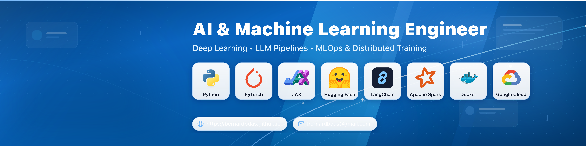
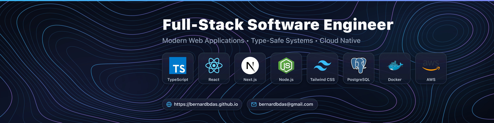
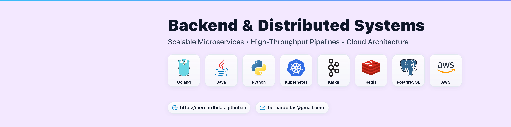

# Tech Stacks Banner Generator

> Curated vector icon repository and automated LinkedIn banner generator (1584 × 396 px) tailored for Tier-1 Big Tech engineering and data roles.

---

## 🖼️ Sample Previews

### LinkedIn Corporate Blue (Network Graph Edition)


### Topography (Dark Mode)


### Topography (Minimalist Light Mode)


### Backend & Distributed Systems (Dark Mode)


---

## ⚡ Quick Start

### 1. Requirements
- Python `>= 3.10`
- [`uv`](https://github.com/astral-sh/uv) (recommended)
- [`librsvg`](https://gitlab.gnome.org/GNOME/librsvg) (for high-res PNG export)
  ```bash
  # macOS
  brew install librsvg

  # Ubuntu / Debian
  sudo apt-get install -y librsvg2-bin
  ```

### 2. Generate Banners
```bash
# Install dependencies
uv sync

# Generate all banners for your active theme (configured in env.local / local.env)
just all

# Generate all banners for a specific theme across all roles (into exported/<theme>/png/ and /svg/)
just linkedin                                # Official LinkedIn corporate blue & network graph
just topographical                           # Dark glowing topography
just topographical-light                     # Minimalist light topography
just dark                                    # Classic dark gradient
just light                                   # Classic light gradient
just theme pastel_aurora                     # Any theme by name

# Generate specific roles (optionally specify theme)
just backend                                 # Uses configured theme
just fullstack topographical_light           # Recreate fullstack in light topography
just ai-ml topographical                     # Recreate AI/ML in dark topography
just devops solid_lavender                   # Recreate DevOps on pastel lavender

# Clean exported/ and regenerate fresh banners
just recreate                                # Recreate default preset & theme
just recreate-all                            # Recreate across all presets & themes
just clean-exported                          # Purge exported/ directory
```

---

## 📋 Available Roles & Previews

All banners are generated into [`exported/<theme>/svg/`](exported/) and [`exported/<theme>/png/`](exported/):

| Target Role | Stack Preview | Topography Dark | Topography Light | Classic Dark |
| :--- | :--- | :---: | :---: | :---: |
| **Backend & Distributed Systems** | Go • Java • Python • K8s • Kafka • Redis • Postgres • AWS | [PNG](exported/topographical/png/banner_backend.png) | [PNG](exported/topographical_light/png/banner_backend.png) | [PNG](exported/dark/png/banner_backend.png) |
| **Full-Stack Software Engineer** | TypeScript • React • Next.js • Node • Tailwind • Postgres • Docker • AWS | [PNG](exported/topographical/png/banner_fullstack.png) | [PNG](exported/topographical_light/png/banner_fullstack.png) | [PNG](exported/dark/png/banner_fullstack.png) |
| **AI & Machine Learning** | Python • PyTorch • JAX • Hugging Face • LangChain • Spark • Docker • GCP | [PNG](exported/topographical/png/banner_ai_ml.png) | [PNG](exported/topographical_light/png/banner_ai_ml.png) | [PNG](exported/dark/png/banner_ai_ml.png) |
| **Cloud & DevOps / SRE** | K8s • Docker • Terraform • AWS • Prometheus • Grafana • Linux | [PNG](exported/topographical/png/banner_devops.png) | [PNG](exported/topographical_light/png/banner_devops.png) | [PNG](exported/dark/png/banner_devops.png) |
| **Mobile Software Engineer** | Swift • Kotlin • Flutter • React Native • Expo • Xcode • Android Studio | [PNG](exported/topographical/png/banner_mobile.png) | [PNG](exported/topographical_light/png/banner_mobile.png) | [PNG](exported/dark/png/banner_mobile.png) |
| **Data Analyst** | SQL • Python • Pandas • Snowflake • BigQuery • dbt • Tableau • Power BI | [PNG](exported/topographical/png/banner_data_analyst.png) | [PNG](exported/topographical_light/png/banner_data_analyst.png) | [PNG](exported/dark/png/banner_data_analyst.png) |
| **Data Scientist** | Python • R • Pandas • Scikit-Learn • PyTorch • SQL • Spark • Snowflake | [PNG](exported/topographical/png/banner_data_scientist.png) | [PNG](exported/topographical_light/png/banner_data_scientist.png) | [PNG](exported/dark/png/banner_data_scientist.png) |
| **Data Engineer** | Python • Spark • Kafka • Airflow • Snowflake • BigQuery • dbt • Docker | [PNG](exported/topographical/png/banner_data_engineer.png) | [PNG](exported/topographical_light/png/banner_data_engineer.png) | [PNG](exported/dark/png/banner_data_engineer.png) |
| **AI Engineer (GenAI & LLMs)** | Python • LangChain • LangGraph • OpenAI • HF • Ollama • PyTorch • Docker | [PNG](exported/topographical/png/banner_ai_engineer.png) | [PNG](exported/topographical_light/png/banner_ai_engineer.png) | [PNG](exported/dark/png/banner_ai_engineer.png) |
| **Machine Learning Engineer** | Python • PyTorch • TensorFlow • JAX • HF • NVIDIA • C++ • Docker | [PNG](exported/topographical/png/banner_ml_engineer.png) | [PNG](exported/topographical_light/png/banner_ml_engineer.png) | [PNG](exported/dark/png/banner_ml_engineer.png) |
| **MLOps Engineer** | Python • Docker • K8s • MLflow • Airflow • W&B • Terraform • Prometheus | [PNG](exported/topographical/png/banner_mlops_engineer.png) | [PNG](exported/topographical_light/png/banner_mlops_engineer.png) | [PNG](exported/dark/png/banner_mlops_engineer.png) |

---

## 🛠️ CLI Usage

```bash
# Basic syntax
python3 -m banners [preset] [theme] [format] [scale] [--fade <value>]
# or
uv run banners [preset] [theme] [format] [scale] [--fade <value>]

# Examples
python3 -m banners backend topographical png         # Generate high-res topographical PNG (6336x1584)
python3 -m banners backend topographical png --fade 40% # Topographical with 40% pattern fade
python3 -m banners fullstack topographical_light all # Fullstack banner in minimalist light topography
python3 -m banners all dark all                      # Generate all role banners in classic dark theme
python3 -m banners backend solid_lavender png 2      # Custom 2x scale on pastel lavender
python3 -m banners --help                            # List all available presets and themes

> **High-Resolution Rendering & Mobile Readability:**
> - All typography (title, subtitle, badge labels) and tech icons are enlarged with proportional spacing and open letter-spacing for high visibility on both mobile devices and desktop screens.
> - Background pattern fade intensity is dynamically customizable via `--fade <value>` (e.g. `--fade 40%`) or `FADE=40%` in your env file.
> - All PNG banners are rendered by default at **4x Ultra-HD resolution (6336 × 1584 px)**, ensuring razor-sharp rendering on Retina and 4K/5K displays without blurriness.

---

## ⚙️ Customization (`env.local` / `local.env`)

You can dynamically customize the default banner preset, background style, portfolio website, and contact email using `env.local` or `local.env`:

1. Copy the template:
   ```bash
   cp example.env env.local
   # or
   cp example.env local.env
   ```
2. Edit `env.local`:
   ```env
   # Website URL displayed on the banner (leave blank to omit)
   WEBSITE_URL=https://yourportfolio.dev

   # Contact email displayed on the banner (leave blank to omit)
   EMAIL=hello@yourportfolio.dev

   # Default preset generated when running `banners` without arguments
   BANNER_NAME=backend

   # Custom background style (from assets/backgrounds/)
   BACKGROUND=topographical

   # Background pattern fade / opacity (e.g. 40%, 60%, 100%, 0.5)
   FADE=100%
   ```
3. Run the generator:
   ```bash
   python3 -m banners
   ```

### 🎨 Available Backgrounds (`assets/backgrounds/`)

Styles can be specified by simple name (e.g. `solid_lavender`) or with category prefix (e.g. `solids/solid_lavender`).

#### 1. Solid Pastel Color Backgrounds (`assets/backgrounds/solids/`)
| Style Name | Tone | Hex Preview / Description |
| :--- | :--- | :--- |
| `solid_lavender` | Lavender | `#F3E8FF` • Soft soothing light lilac |
| `solid_blush` | Blush Rose | `#FCE7F3` • Delicate soft rose blush |
| `solid_peach` | Peach | `#FFEDD5` • Warm light apricot peach |
| `solid_cream` | Vanilla Cream | `#FEFCE8` • Gentle soft warm cream |
| `solid_mint` | Neo-Mint | `#ECFDF5` • Fresh sage & seafoam green |
| `solid_sky` | Baby Sky Blue | `#F0F9FF` • Crisp serene pale sky blue |
| `solid_periwinkle` | Periwinkle | `#EEF2FF` • Crisp ice periwinkle |
| `solid_sand` | Neutral Sand | `#FAFAF9` • Warm minimalist clean linen |

#### 2. Pastel Gradient Backgrounds (`assets/backgrounds/gradients/`)
| Style Name | Description |
| :--- | :--- |
| `pastel_aurora` | Radiant aurora borealis gradient with lavender, rose, and cyan |
| `pastel_mesh` | Multi-point modern pastel mesh blending coral, lilac, and mint |
| `pastel_sunset` | Warm golden-hour apricot, peach, and soft rose glow |
| `pastel_mint` | Fresh neo-mint and seafoam green with subtle tech grid |
| `pastel_geometry` | Pastel canvas with floating modern vector geometric accents |

#### 3. Pattern & Topography Backgrounds (`assets/backgrounds/patterns/`)
| Style Name | Description |
| :--- | :--- |
| `linkedin` | Official LinkedIn platform UI blue (`#0A66C2`), white tech badge cards, angled geometric facets & career velocity arcs |
| `network_nodes` | Deep navy constellation network mesh, interconnected graph nodes & glowing signal vertices |
| `topographical` | High-tech elevation contour map with luminous isolines on dark canvas |
| `topographical_light` | Minimalist clean white/slate GIS elevation contour relief with nested loops |
| `topographical_pastel` | Multi-tone elevation contour lines over a soft pastel gradient |
| `topographical_dense` | High-density alpine relief terrain with intricate contour ridges |
| `grid_matrix` | Cyberpunk / blueprint dot matrix with crosshair targets |
| `circuit_board` | Microchip bus lines, 45° angled traces, and glowing nodes |
| `flowing_waves` | Parametric sinusoidal wave ribbon curves |

> [!TIP]
> You can also quickly preview any background from the CLI using the `--bg` flag:
> ```bash
> python3 -m banners fullstack dark png --bg topographical
> python3 -m banners fullstack light png --bg topographical_light
> ```

> [!NOTE]
> `env.local` and `local.env` are ignored by Git, keeping your personal contact information and local preferences private.

---

## 📁 Repository Layout

- [`assets/`](assets/) — Static assets:
  - [`assets/icons/`](assets/icons/) — 75 curated vector tech stack icons organized by discipline (`backend/`, `frontend/`, `ai-ml/`, `cloud-devops/`, `databases/`, `messaging/`, `mobile/`).
  - [`assets/backgrounds/`](assets/backgrounds/) — Custom backgrounds separated by type:
    - [`patterns/`](assets/backgrounds/patterns/) — Topographical, grid, circuit, and wave patterns.
    - [`gradients/`](assets/backgrounds/gradients/) — Flowing multi-stop pastel gradients.
    - [`solids/`](assets/backgrounds/solids/) — Solid pastel colors in light shades.
- [`exported/`](exported/) — Generated output banners organized by theme and separated into `svg/` and `png/` subfolders (`exported/<theme>/svg/`, `exported/<theme>/png/`).
- [`banners/`](banners/) — Core generation package (color adapter, SVG processor, layout dimensions, background loader, renderer).
- [`tests/`](tests/) — Complete test suite for presets, rendering, themes, backgrounds, and CLI.

---

## 🧪 Development & Quality Assurance

This repository uses **Ruff** for linting/formatting, **pre-commit** hooks, and **GitHub Actions** for CI.

```bash
# Run linting, formatting check, and test suite
just check

# Automatically reformat code with ruff
just format

# Run linter checks
just lint

# Run unit tests only
just test

# Install pre-commit hooks into git
uv run pre-commit install
```
