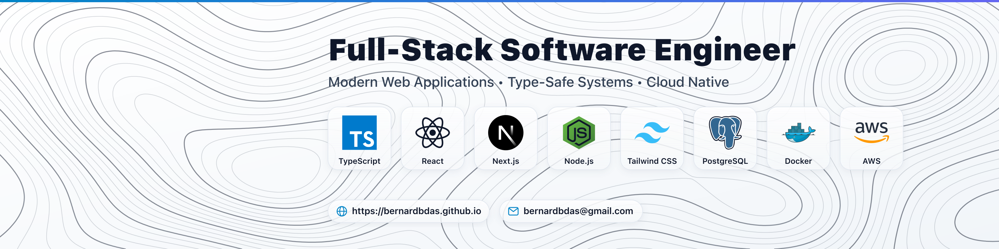
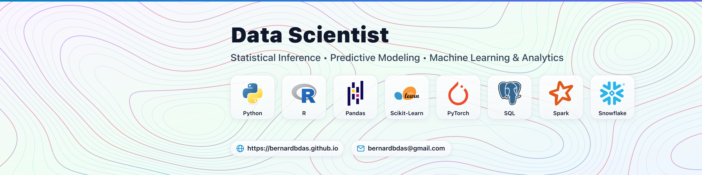
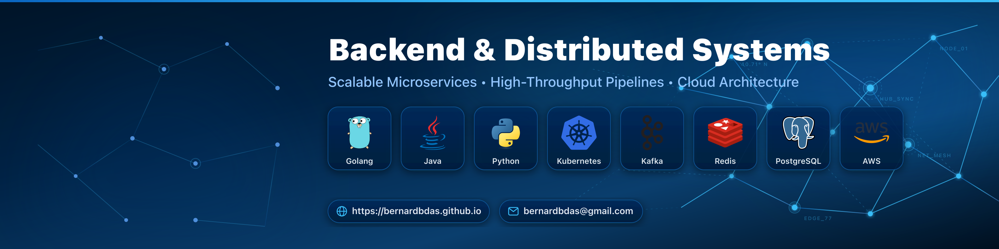

# LinkedIn Tech Stack Banner Generator

Generate custom 1584 × 396 px banners for LinkedIn profiles featuring curated tech stack icons, custom backgrounds, and portfolio details.

---

## Previews

### Topographical (Dark)


### Topographical (Light)


### Topographical (Pastel)


### LinkedIn Platform Theme


### Network Nodes


---

## Getting Started

### Prerequisites
- Python >= 3.10
- [uv](https://github.com/astral-sh/uv) (recommended)
- [librsvg](https://gitlab.gnome.org/GNOME/librsvg) (required for rasterizing to PNG):
  - macOS: `brew install librsvg`
  - Ubuntu/Debian: `sudo apt-get install -y librsvg2-bin`

### Quick Start
```bash
# Install dependencies
uv sync

# Generate the default banner configured in local.env
just

# Generate banners for all roles in a specific theme
just topographical
just topographical-light
just linkedin
just network-nodes

# Generate all banners across every role
just all
```

Outputs are saved to `exported/<theme>/svg/` and `exported/<theme>/png/`. PNGs are rasterized at 4x resolution (`6336 × 1584 px`) by default.

---

## CLI Usage

Run via `just` shortcuts or the CLI directly:

```bash
# Syntax
python3 -m banners [preset] [theme] [format] [scale] [--fade <value>]

# Examples
python3 -m banners backend topographical png
python3 -m banners fullstack topographical_light all
python3 -m banners ai_ml linkedin png
python3 -m banners backend topographical png --fade 40%
python3 -m banners backend solid_lavender png 2
python3 -m banners --help
```

---

## Roles and Stacks

| Role | Preset Name | Stack Icons |
| :--- | :--- | :--- |
| **Backend & Distributed Systems** | `backend` | Go, Java, Python, Kubernetes, Kafka, Redis, PostgreSQL, AWS |
| **Full-Stack Engineer** | `fullstack` | TypeScript, React, Next.js, Node.js, Tailwind CSS, PostgreSQL, Docker, AWS |
| **AI & Machine Learning** | `ai_ml` | Python, PyTorch, JAX, Hugging Face, LangChain, Apache Spark, Docker, Google Cloud |
| **Cloud & DevOps / SRE** | `devops` | Kubernetes, Docker, Terraform, AWS, Prometheus, Grafana, Linux |
| **Mobile Engineer** | `mobile` | Swift, Kotlin, Flutter, React Native, Expo, Xcode, Android Studio |
| **Data Analyst** | `data_analyst` | SQL, Python, Pandas, Snowflake, BigQuery, dbt, Tableau, Power BI |
| **Data Scientist** | `data_scientist` | Python, R, Pandas, Scikit-Learn, PyTorch, SQL, Apache Spark, Snowflake |
| **Data Engineer** | `data_engineer` | Python, Apache Spark, Kafka, Airflow, Snowflake, BigQuery, dbt, Docker |
| **AI Engineer (GenAI & LLMs)** | `ai_engineer` | Python, LangChain, LangGraph, OpenAI, Hugging Face, Ollama, PyTorch, Docker |
| **Machine Learning Engineer** | `ml_engineer` | Python, PyTorch, TensorFlow, JAX, Hugging Face, NVIDIA, C++, Docker |
| **MLOps Engineer** | `mlops_engineer` | Python, Docker, Kubernetes, MLflow, Airflow, Weights & Biases, Terraform, Prometheus |

---

## Themes and Backgrounds

Background SVGs are located in `assets/backgrounds/`. Any background file can be passed as the theme argument.

### Patterns and Topography (`assets/backgrounds/patterns/`)
- `topographical`: Dark elevation contours with glowing isolines.
- `topographical_light`: Minimalist clean white/slate elevation contour map.
- `topographical_pastel`: Contour relief over a soft pastel gradient.
- `topographical_dense`: High-density alpine terrain contour lines.
- `linkedin`: Official LinkedIn platform blue with white cards and angled brand facets.
- `network_nodes`: Deep navy mesh with interconnected graph nodes and vertices.
- `grid_matrix`: Technical dot matrix blueprint with crosshairs.
- `circuit_board`: Microchip traces and bus routes.
- `flowing_waves`: Parametric sine wave ribbon curves.

### Pastel Gradients (`assets/backgrounds/gradients/`)
- `pastel_aurora`: Aurora borealis gradient blending lavender, rose, and cyan.
- `pastel_mesh`: Multi-point gradient blending coral, lilac, and mint.
- `pastel_sunset`: Warm golden-hour apricot, peach, and soft rose tones.
- `pastel_mint`: Neo-mint and seafoam green with a subtle grid overlay.
- `pastel_geometry`: Soft pastel canvas with floating geometric shapes.

### Solid Pastels (`assets/backgrounds/solids/`)
- `solid_lavender` (`#F3E8FF`), `solid_blush` (`#FCE7F3`), `solid_peach` (`#FFEDD5`), `solid_cream` (`#FEFCE8`), `solid_mint` (`#ECFDF5`), `solid_sky` (`#F0F9FF`), `solid_periwinkle` (`#EEF2FF`), `solid_sand` (`#FAFAF9`).

---

## Configuration

Copy `example.env` to `local.env` or `env.local` (both are git-ignored):

```bash
cp example.env local.env
```

Available options:

```env
# Website URL displayed on the banner (leave blank to omit)
WEBSITE_URL=https://yourdomain.com

# Contact email displayed on the banner (leave blank to omit)
EMAIL=hello@yourdomain.com

# Default preset (e.g. backend, fullstack, ai_ml, etc.)
BANNER_NAME=backend

# Default theme or background (e.g. topographical, topographical_light, linkedin)
THEME=topographical

# Pattern fade intensity (percentage or float: e.g. 40%, 60%, 100%, 0.5)
FADE=100%
```

---

## Repository Structure

- `assets/icons/`: 75 vector tech stack icons organized by discipline (`backend/`, `frontend/`, `ai-ml/`, `cloud-devops/`, `databases/`, `messaging/`, `mobile/`).
- `assets/backgrounds/`: Background patterns, gradients, and solid colors.
- `assets/previews/`: Pre-rendered sample previews used in documentation.
- `banners/`: Core banner generator, SVG processor, color adapter, and CLI.
- `exported/`: Output directory for generated SVG and PNG banners.
- `tests/`: Test suite for presets, themes, rasterization, backgrounds, and CLI.

---

## Development

```bash
# Run tests, linter, and formatting checks
just check

# Run tests only
just test

# Format code
just format

# Lint code
just lint
```
