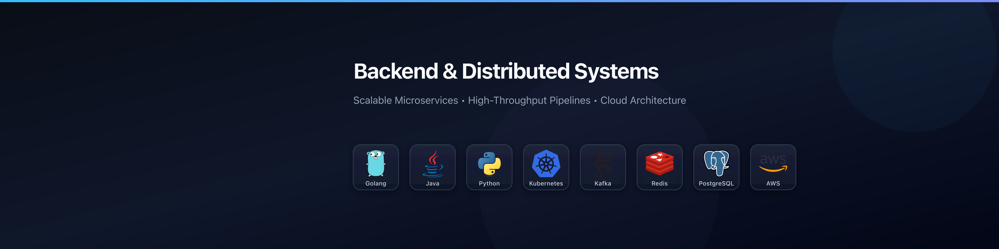
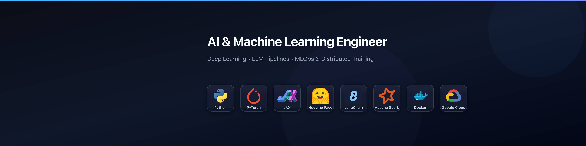

# Tech Stacks Banner Generator

> Curated vector icon repository and automated LinkedIn banner generator (1584 × 396 px) tailored for Tier-1 Big Tech engineering and data roles.

---

## 🖼️ Sample Previews

### Backend & Distributed Systems (Dark Mode)


### AI & Machine Learning Engineer (Dark Mode)


### Cloud & DevOps / SRE (Light Mode)


---

## ⚡ Quick Start

### 1. Requirements
- Python `>= 3.10`
- [`uv`](https://github.com/astral-sh/uv) (recommended)
- [`librsvg`](https://gitlab.gnome.org/GNOME/librsvg) (for high-res PNG export)
  ```bash
  # macOS
  brew install librsvg

  # Ubuntu / Debian
  sudo apt-get install -y librsvg2-bin
  ```

### 2. Generate Banners
```bash
# Install dependencies
uv sync

# Generate all banners (Dark & Light, PNG & SVG into exported/)
just all

# Or generate specific roles
just backend
just fullstack
just ai-ml
just devops
just mobile
just roles        # All 6 specialized data & AI roles
```

---

## 📋 Available Roles & Previews

All banners are generated into [`exported/`](exported/):

| Target Role | Stack Preview | Dark Mode | Light Mode |
| :--- | :--- | :---: | :---: |
| **Backend & Distributed Systems** | Go • Java • Python • K8s • Kafka • Redis • Postgres • AWS | [PNG](exported/png/dark/banner_backend.png) • [SVG](exported/svg/dark/banner_backend.svg) | [PNG](exported/png/light/banner_backend.png) • [SVG](exported/svg/light/banner_backend.svg) |
| **Full-Stack Software Engineer** | TypeScript • React • Next.js • Node • Tailwind • Postgres • Docker • AWS | [PNG](exported/png/dark/banner_fullstack.png) • [SVG](exported/svg/dark/banner_fullstack.svg) | [PNG](exported/png/light/banner_fullstack.png) • [SVG](exported/svg/light/banner_fullstack.svg) |
| **AI & Machine Learning** | Python • PyTorch • JAX • Hugging Face • LangChain • Spark • Docker • GCP | [PNG](exported/png/dark/banner_ai_ml.png) • [SVG](exported/svg/dark/banner_ai_ml.svg) | [PNG](exported/png/light/banner_ai_ml.png) • [SVG](exported/svg/light/banner_ai_ml.svg) |
| **Cloud & DevOps / SRE** | K8s • Docker • Terraform • AWS • Prometheus • Grafana • Linux | [PNG](exported/png/dark/banner_devops.png) • [SVG](exported/svg/dark/banner_devops.svg) | [PNG](exported/png/light/banner_devops.png) • [SVG](exported/svg/light/banner_devops.svg) |
| **Mobile Software Engineer** | Swift • Kotlin • Flutter • React Native • Expo • Xcode • Android Studio | [PNG](exported/png/dark/banner_mobile.png) • [SVG](exported/svg/dark/banner_mobile.svg) | [PNG](exported/png/light/banner_mobile.png) • [SVG](exported/svg/light/banner_mobile.svg) |
| **Data Analyst** | SQL • Python • Pandas • Snowflake • BigQuery • dbt • Tableau • Power BI | [PNG](exported/png/dark/banner_data_analyst.png) • [SVG](exported/svg/dark/banner_data_analyst.svg) | [PNG](exported/png/light/banner_data_analyst.png) • [SVG](exported/svg/light/banner_data_analyst.svg) |
| **Data Scientist** | Python • R • Pandas • Scikit-Learn • PyTorch • SQL • Spark • Snowflake | [PNG](exported/png/dark/banner_data_scientist.png) • [SVG](exported/svg/dark/banner_data_scientist.svg) | [PNG](exported/png/light/banner_data_scientist.png) • [SVG](exported/svg/light/banner_data_scientist.svg) |
| **Data Engineer** | Python • Spark • Kafka • Airflow • Snowflake • BigQuery • dbt • Docker | [PNG](exported/png/dark/banner_data_engineer.png) • [SVG](exported/svg/dark/banner_data_engineer.svg) | [PNG](exported/png/light/banner_data_engineer.png) • [SVG](exported/svg/light/banner_data_engineer.svg) |
| **AI Engineer (GenAI & LLMs)** | Python • LangChain • LangGraph • OpenAI • HF • Ollama • PyTorch • Docker | [PNG](exported/png/dark/banner_ai_engineer.png) • [SVG](exported/svg/dark/banner_ai_engineer.svg) | [PNG](exported/png/light/banner_ai_engineer.png) • [SVG](exported/svg/light/banner_ai_engineer.svg) |
| **Machine Learning Engineer** | Python • PyTorch • TensorFlow • JAX • HF • NVIDIA • C++ • Docker | [PNG](exported/png/dark/banner_ml_engineer.png) • [SVG](exported/svg/dark/banner_ml_engineer.svg) | [PNG](exported/png/light/banner_ml_engineer.png) • [SVG](exported/svg/light/banner_ml_engineer.svg) |
| **MLOps Engineer** | Python • Docker • K8s • MLflow • Airflow • W&B • Terraform • Prometheus | [PNG](exported/png/dark/banner_mlops_engineer.png) • [SVG](exported/svg/dark/banner_mlops_engineer.svg) | [PNG](exported/png/light/banner_mlops_engineer.png) • [SVG](exported/svg/light/banner_mlops_engineer.svg) |

---

## 🛠️ CLI Usage

```bash
# Basic syntax
python3 -m banners [preset] [theme] [format] [scale]
# or
uv run banners [preset] [theme] [format] [scale]

# Examples
python3 -m banners backend dark png        # Generate high-res dark PNG (6336x1584, 4x default)
python3 -m banners ai-ml all svg           # Generate SVGs (both themes) for AI/ML
python3 -m banners all all all             # Generate all banners in all themes & formats
python3 -m banners backend dark png 2      # Custom 2x scale (3168x792)
python3 -m banners --help                  # List all options
```

> **High-Resolution Rendering:** All PNG banners are rendered by default at **4x Ultra-HD resolution (6336 × 1584 px)**, ensuring razor-sharp typography and icons on Retina, 4K/5K displays, and deep zoom levels (400%–600%+), while maintaining file sizes well under 500 KB (compatible with LinkedIn's 8 MB upload limit).

---

## 📁 Repository Layout

- [`assets/`](assets/) — 75 curated vector SVG tech stack icons organized by discipline.
- [`exported/`](exported/) — Generated output banners organized by format (`svg/`, `png/`) and theme (`dark/`, `light/`).
- [`banners/`](banners/) — Core generation package (color adapter, SVG parser, dimensions, renderer).
- [`tests/`](tests/) — Complete test suite for presets, rendering, themes, and CLI.

---

## 🧪 Development & Quality Assurance

This repository uses **Ruff** for linting/formatting, **pre-commit** hooks, and **GitHub Actions** for CI.

```bash
# Run linting, formatting check, and test suite
just check

# Automatically reformat code with ruff
just format

# Run linter checks
just lint

# Run unit tests only
just test

# Install pre-commit hooks into git
uv run pre-commit install
```
